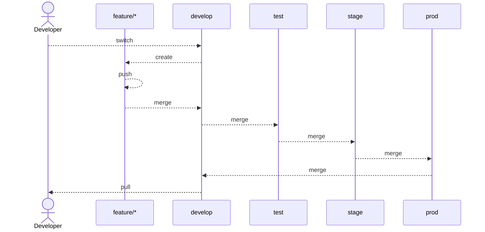

# POC #01 - React Node Setup

## System Architecture

### 01. High Level Design (HLD)

### 02. Low Level Design (LLD)

### 02.01. Git Branching & PR Strategies LLD

```mermaid
  sequenceDiagram
    actor Developer
    participant feature/*
    participant develop
    participant test
    participant stage
    participant prod

    Developer -->> develop : switch
    develop -->> feature/* : create
    feature/* -->> feature/* : push
    feature/* -->> develop : merge
    develop -->> test : merge
    test -->> stage : merge
    stage -->> prod : merge
    prod -->> develop : merge
    develop -->> Developer : pull
```
