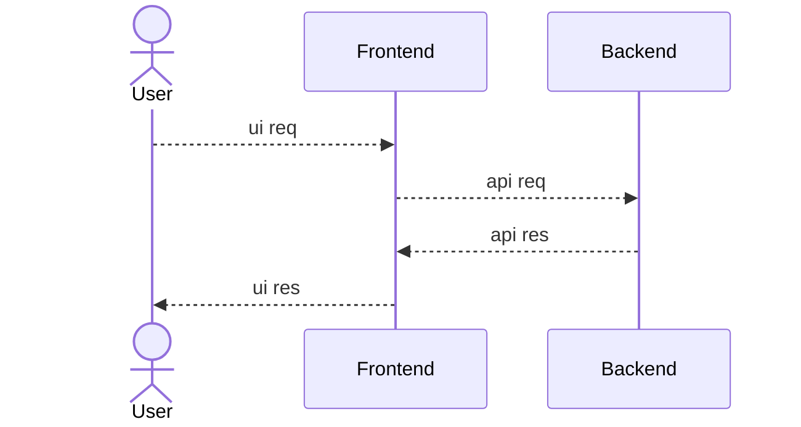
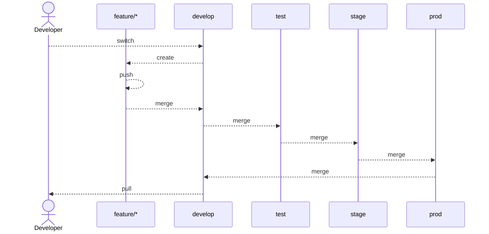
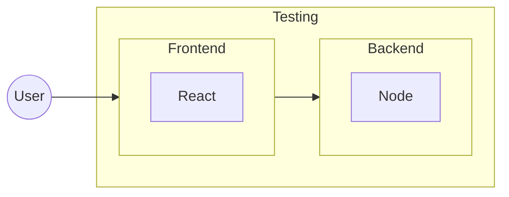
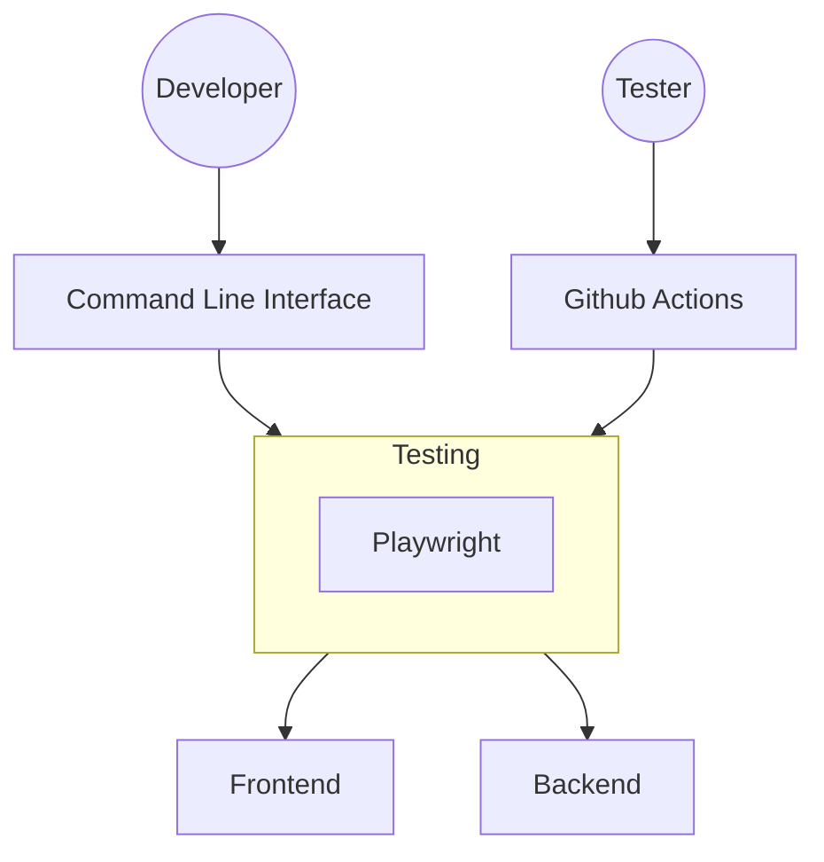
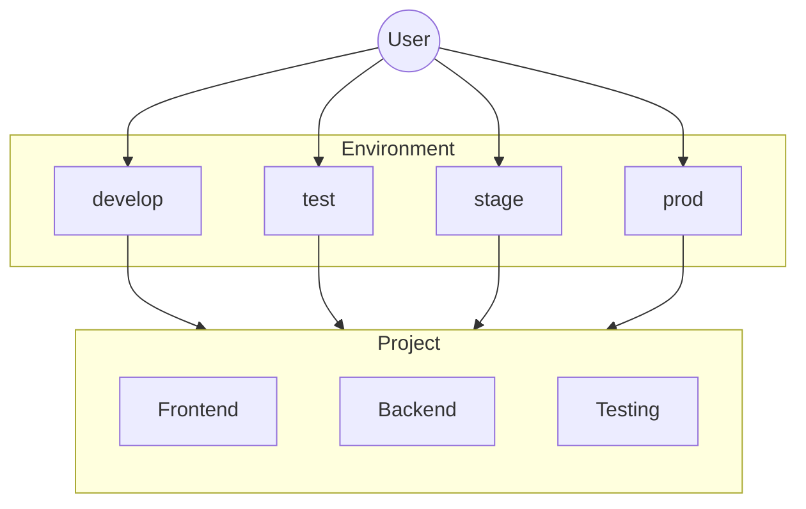
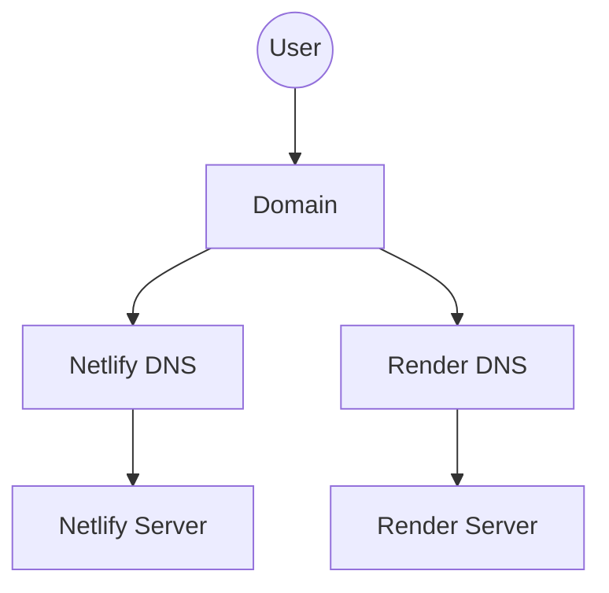

# POC #01 - React Node Setup
Production Grade - Proof of Concept for React & Node Connection

## System Architecture

### 01. High Level Design (HLD)

### 02. Low Level Design (LLD)

#### 02.01. Git Branching & PR Strategies LLD

#### 02.02. Project Overview LLD

#### 02.03. Playwright Connection LLD

#### 02.04. Environment Connection LLD

#### 02.05. Servers & DNS LLD

## Servers & DNS

### Backend
- Development
  - Local: [http://localhost:8001](http://localhost:8001)
  - Live: [https://react-node-v01-backend-develop.onrender.com](https://react-node-v01-backend-develop.onrender.com)
- Testing
  - Local: [http://localhost:8002](http://localhost:8000)
  - Live: [https://react-node-v01-backend-test.onrender.com](https://react-node-v01-backend-test.onrender.com)
- Staging
  - Local: [http://localhost:8003](http://localhost:8000)
  - Live: [https://react-node-v01-backend-stage.onrender.com](https://react-node-v01-backend-stage.onrender.com)
- Production
  - Local: [http://localhost:8004](http://localhost:8000)
  - Live: [https://react-node-v01-backend-prod.onrender.com](https://react-node-v01-backend-prod.onrender.com)

### Frontend
- Development
  - Local: [http://localhost:3001](http://localhost:3001)
  - Live: [https://react-node-v01-frontend-develop.netlify.app](https://react-node-v01-frontend-develop.netlify.app)
- Testing
  - Local: [http://localhost:3002](http://localhost:3002)
  - Live: [https://react-node-v01-frontend-test.netlify.app](https://react-node-v01-frontend-test.netlify.app)
- Staging
  - Local: [http://localhost:3003](http://localhost:3003)
  - Live: [https://react-node-v01-frontend-stage.netlify.app](https://react-node-v01-frontend-stage.netlify.app)
- Production
  - Local: [http://localhost:3004](http://localhost:3004)
  - Live: [https://react-node-v01-frontend-prod.netlify.app](https://react-node-v01-frontend-prod.netlify.app)

### Testing
- Local Report: [http://localhost:9323](http://localhost:9323)
- Live Report: 
