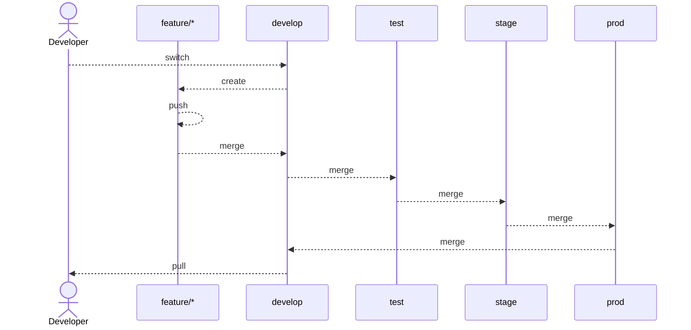
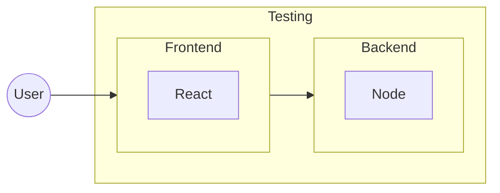
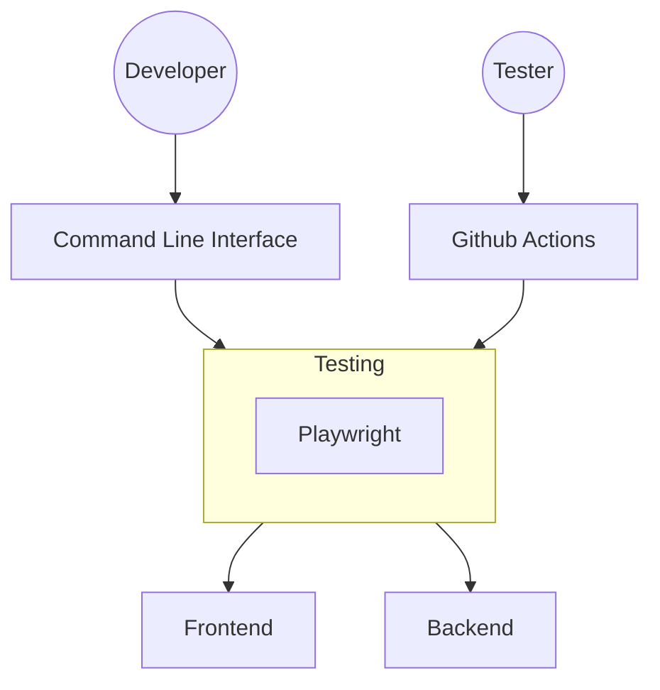

# POC #01 - React Node Setup

## System Architecture

### 01. High Level Design (HLD)

### 02. Low Level Design (LLD)

### 02.01. Git Branching & PR Strategies LLD

### 02.02. Project Overview LLD

### 02.03. Playwright Connection LLD

## Servers & DNS

### Backend
- Development
  - Local: [http://localhost:8000](http://localhost:8000)
  - Live: 
- Testing
  - Local: [http://localhost:8000](http://localhost:8000)
  - Live: 
- Staging
  - Local: [http://localhost:8000](http://localhost:8000)
  - Live: 
- Production
  - Local: [http://localhost:8000](http://localhost:8000)
  - Live: 

### Frontend
- Development
  - Local: 
  - Live: 
- Testing
  - Local: 
  - Live: 
- Staging
  - Local: 
  - Live: 
- Production
  - Local: 
  - Live: 

### Testing
- Local Report: [http://localhost:9323](http://localhost:9323)
- Live Report: 
